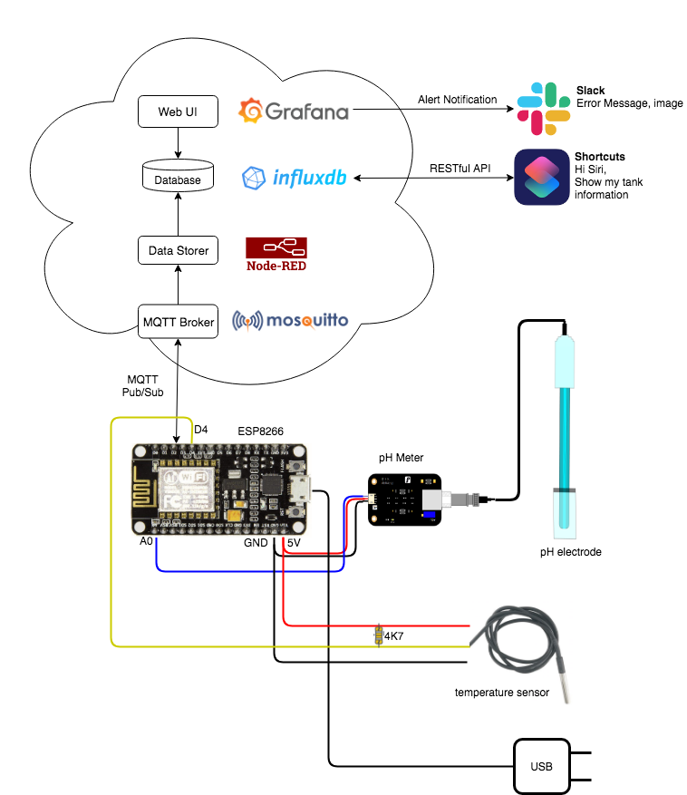

# Auto Tank
IoT Cloud Solution for Reef Tank Data Monitoring and Remote Control

## Overview

Use an ESP8266 Wifi board (Arduino compatible) with pH meter and temperature sensor to publish sensor data through MQTT. The MQTT broker is hosted on the cloud. Using a Node-RED to subscribe to the MQTT sensor data and store to InfluxDB. Grafana is used to show the historical sensor data and set alert conditions for the value worthing notification. You can also ask Siri to report the last status of your reef tank.


## Features

- Monitor historical pH value of your reef tank, including the two-point calibration
- Monitor historical temperature of your reef tank
- Get the status of my tank by Siri
- Get alert notification by Slack
- Low cost
- Private Cloud Solution

## Getting Started

### Prerequisites

* Local Side
	1. ESP8266 board with wifi
	1. Analog pH Meter Pro Sensor
	1. Calibration Solution pH7 and pH10
	1. DS18B20 waterproof temperature sensor
	1. Breadboard
	1. Breadboard connectors
	1. Micro USB cable and power adapter

* Cloud Side
    1. A server (CPU:1 Core, 1GB RAM at least)
    1. Public IP (If private IP, you can only access inside the local network. Use port forward to access on the internet)
    1. [Install Docker Engine](https://docs.docker.com/install/) on the server
    1. [Install GIT](https://git-scm.com/book/en/v2/Getting-Started-Installing-Git) to get the source code on Github

* For example, my cloud settings are as follows:
    1. Apply an AWS EC2 VM
        1. Choose Ubuntu 16.04 t2.micro
        2. Create a Security Group. Add Rule for TCP, Source: Anywhere, with
            1. MQTT:1883
            2. NodeRed:1880
            3. Grafana:3000
            4. InfluxDB:8086
        3. Instances > Actions > Networking > Change Security Groups.
    2. Install Docker ```./bin/system/install_docker.sh```
    3. Add Port in iptable ```./bin/system/add_port.sh ```
    4. Save iptables ```./bin/system/save_iptables.sh```

### Installing

1. Get the source code on server `git clone https://github.com/samuelchiang/auto_tank.git`
1. docker swarm init `docker swarm init`
1. Start server  `./start.sh `
1. Check 4 services are running (REPLICAS are all 1/1)

	```
	# docker service ls
	ID                  NAME                 MODE                REPLICAS            IMAGE                      PORTS
	xpsuie57lg4t        auto_tank_grafana    replicated          1/1                 grafana/grafana:latest     *:3000->3000/tcp
	eyogf84hi5r5        auto_tank_influxdb   replicated          1/1                 influxdb:latest            *:8086->8086/tcp
	r2rswub5twid        auto_tank_mqtt       replicated          1/1                 eclipse-mosquitto:latest   *:1883->1883/tcp
	4wru608dlc0s        auto_tank_nodered    replicated          1/1                 nodered/node-red:latest    *:1880->1880/tcp
	```

### Setup MQTT

* Optional: MQTT broker default Username:Password is admin:admin. To change it, you can refer my example as follows:

	```
	# docker ps -a |grep mqtt
	1e4aa4a364db        eclipse-mosquitto:latest   "/docker-entrypoint.…"   41 minutes ago      Up 41 minutes       1883/tcp            auto_tank_mqtt.1.ygfkpzlf3qpn82koc2c2prftt
	# docker exec -ti auto_tank_mqtt.1.ygfkpzlf3qpn82koc2c2prftt sh
	# cd /mosquitto/config/
	/mosquitto/config # ls
	mosquitto.conf  mqttpasswd
	/mosquitto/config # mosquitto_passwd -c mqttpasswd admin
	Password: your_password_here
	# exit
	# docker service update auto_tank_mqtt
	```

### Setup InfluxDB

*  To setup InfluxDB username and password and create database, you can refer my example as follows (change 'your password'):

	```
	# docker ps -a|grep influx
	5c790c7b4dcb        influxdb:latest            "/entrypoint.sh infl…"   54 minutes ago      Up 54 minutes       8086/tcp            auto_tank_influxdb.1.v7fss7y63fbfo5zqpqa1c3x2f
	root@ubuntu:~/auto_tank/node-red/data# docker exec -ti auto_tank_influxdb.1.v7fss7y63fbfo5zqpqa1c3x2f influx
	Connected to http://localhost:8086 version 1.7.8
	InfluxDB shell version: 1.7.8
	> CREATE USER admin WITH PASSWORD 'your password' WITH ALL PRIVILEGES
	> CREATE DATABASE "mytank"
	> show databases
	name: databases
	name
	----
	_internal
	mytank
	> exit
	```

### Setup Node-RED

1. Browse Node-RED
	1. Using a browser to open ```http://<server ip>:1880/```, default username, password is admin:admin
	1. (Optional) You can [change Node-RED password](https://nodered.org/docs/user-guide/runtime/securing-node-red)
1. Import Flows from file
	1. Find `flows.json` in project path `node-red/data/`
	1. Press Top-Right menu button > Import > flows.json
1. Configure InfluxDB
	1. Press Top-Right menu button > Manage palette > Install > search influxdb > install node-red-contrib-influxdb
	1. On "Data Storer" tab, click "influxdb" node > edit server >  input Username:Password > Done > Deploy
	1. Press the timestamp for Query (SELECT * FROM dev1), you can see the debug message, now it's [ empty ] because of no data, but no error.
1. Configure MQTT
	1. On "Data Storer" tab, click "data/dev1" node > edit server > Security > input MQTT Username:Password (default) admin:admin > Done > Deploy
	1. If the username and password is correct, the MQTT "data/dev1" node show "connected".

### Setup Grafana

1. Browse Grafana
	1. Using a browser to open ```http://<server ip>:3000/```, default username, password is admin:admin, the web UI will ask you to change the password.
1. Configure Data Source
	1. On "Home Dashboard", Add data source > InfluxDB
		1.  URL: `http://influxdb:8086`
		1.  Database: `mytank`
		1. User: `admin`
		1. Password: `your password`
	1. Save & Test => Data source is working
1. Import Dashboard		
	1. Find `MyTank-xxxx.json` in project path `grafana_dashboard/`
	1. On Left menu:  "+" > Import > Upload .json file >  `MyTank-xxxx.json` >  Select a InfluxDB data source > InfluxDB > Import
	1. Now you get a dashboard with pH and temperature, but no data.
	
### Setup Local Side

1. [Install Arduino driver for your PC or Mac](https://www.silabs.com/products/development-tools/software/usb-to-uart-bridge-vcp-drivers)
1. [Use Arduino IDE for ESP8266](https://randomnerdtutorials.com/how-to-install-esp8266-board-arduino-ide/)
1. Connect ESP8266, DS18B20 and pH meter with a breadboard, the pin is shown as the architecture picture on the overview section.
1. Configure program `PH_Meter`
	1. Find Arduino file `ph_meter.ino` on project path `arduino/PH_Meter/`
	1. Use Arduino IDE to open file: `ph_meter.ino`
	1. Edit the parameters:
		1. const char* ssid = “Your Wifi AP SSID";
		2. const char* password = "Your Wifi AP Password";
		3. const char* mqttServer = "MQTT IP address";  
		4. const char* mqttUserName = “MQTT username; 
		5. const char* mqttPwd = "MQTT password"; 
	1. Install Libraries
		1.  [How to install](https://www.arduino.cc/en/Guide/Libraries)
		1. From Sketch > Include Library > Manage Libraries > Library Manager
			1. [PubSubClient by Nick O'Leary](https://pubsubclient.knolleary.net/)
			1. [NTPClient by Fabrice Weinberg](https://github.com/arduino-libraries/NTPClient)
			1. [ArduinoJson by Benolt Bjanchon](https://arduinojson.org/?utm_source=meta&utm_medium=library.properties)
			1. [OneWire](https://www.pjrc.com/teensy/td_libs_OneWire.html)
			1. [DallasTemperature](https://github.com/milesburton/Arduino-Temperature-Control-Library)
	1. Verify
	1. Upload
1. Check if data is publishing
	1. From Node-RED Data Storer Debug message, you can check if there are message as below for every 20 seconds.
	```
	"{ "id":"dev1", "temp":24.31, "ph":8.34, "voltage":777.76}"
	```	
	1. From Grafana Dashboard, there are data for pH and temperature.

### pH Calibration

1. How it works: Voltages V1, V2 are measured at PH7 and PH10. Since the pH meter can be regarded as linear in a small range, it's a linear function: `pH = S*voltage+Offset`

	```
        7  = S*V1+Offset
        10 = S*V2+Offset
        =>  S = (10-7) / (V2-V1)
        =>  Offset =  7 - S*V1
	```	

2.  Calibration procedure:
	1. The pH probe is first washed with ordinary cold water, then blotted with tissue paper (do not use rough toilet paper), do not rotate it, otherwise, it will permanently damage the probe coating, seriously affecting the accuracy!
	2. Browse Node-RED > PH Calibration tab
	3. Put the probe into the pH7 calibration solution and wait at least 1.5cm for 20 seconds, then click the box on the left side of cmd_ph7cal. After 10 seconds, the average value V1 will be automatically obtained.
	4. Put the probe into the pH10 calibration solution and wait at least 1.5cm for 20 seconds. Then click the box on the left side of cmd_ph10cal. After 10 seconds, the average value V2 will be automatically obtained, which the calibration is done.
	5. The calibration order of pH7 and pH10 cannot be reversed. The two calibrations must be completed at one time, otherwise please restart ESP8266.
	6. The Calibration result can be seen by the Node-RED debug message, with MQTT topic 'event/dev1', in my case
	```
	{ "id":"dev1", "ts":"20:41:36", "voltage7":593.32, "voltage10":1008.61, "ph_slope":"0.007247947", "ph_offset":"2.699647957”}
	```
	7. The data can also be seen by the Node-RED debug message, with MQTT topic 'data/dev1', in my case
        ```
        { "id":"dev1", "temp":23.75, "ph":8.36, "voltage":781.42}
        ```
        
### Setup Siri Shortcut to get the status of tank

1. Use iPhone to install [Shortcut](https://apps.apple.com/app/shortcuts/id915249334) App
2. Use a browser to open the [Shortcut link](https://www.icloud.com/shortcuts/cae18371554d4cdc8b5840c3817709d2), install it in your shortcut app.
3. This app will ask for input server_ip, influxdb_username, and influxdb_password, fill them.
4. Press play button to execute
5. Press the setting button, "Add to Siri". Then you can get the tank status by Siri voice command.


### Setup Slack to get the alert notification

* Please refer to [Grafana](https://grafana.com/docs/alerting/notifications/) and [Slack](https://api.slack.com/messaging/webhooks) official documents for setting if necessary.    

## Built With

* [InfluxDB](https://www.influxdata.com/) - Time Series Database
* [Grafana](https://grafana.com/) - The open observability platform
* [Node-RED](https://nodered.org/) -  Flow-based development tool
* [Mosquitto](https://mosquitto.org/) - Lightweight MQTT Broker
* [Docker](https://www.docker.com/) - Container Platform
* [Arduino](https://www.arduino.cc/) - Open-source hardware of microcontroller
* [ESP8266](https://www.espressif.com/en/products/hardware/esp8266ex/overview) - low-cost Wi-Fi microchip with full TCP/IP stack and microcontroller capability. Compatible with Arduino 

## Contributing

Please read [CONTRIBUTING.md](./CONTRIBUTING.md) for details on our code of conduct, and the process for submitting pull requests to us.

## Versioning

We use [SemVer](http://semver.org/) for versioning. For the versions available, see the [tags on this repository](https://github.com/samuelchiang/auto_tank/tags). 

## Authors

* **[Samuel Chiang](https://github.com/samuelchiang)** - *Initial work* 

See also the list of [contributors](https://github.com/samuelchiang/contributors) who participated in this project.

## License

This project is licensed under the MIT License - see the [LICENSE.md](./LICENSE.md) file for details

## Acknowledgments

* [pH8.4](https://www.ph84.idv.tw/forum/) - I start Reef Tank from here
* [REEF2REEF](https://www.reef2reef.com) -  Worlds largest reef tank user forum
* [shih87: Siri Control of Apex (SCA) without HomeBridge](https://www.reef2reef.com/ams/siri-control-of-apex-sca-without-homebridge.630/?fbclid=IwAR0ei5UAl6Q--rMBDr_i6P8zN3L-P4-NAvwYGrNnuu0CcKem6OUY1dtCcPU) - Inspire me to get data over Siri
* [KHG author](https://www.facebook.com/groups/1768033033431949/) - Inspire me for how to calibrate pH

